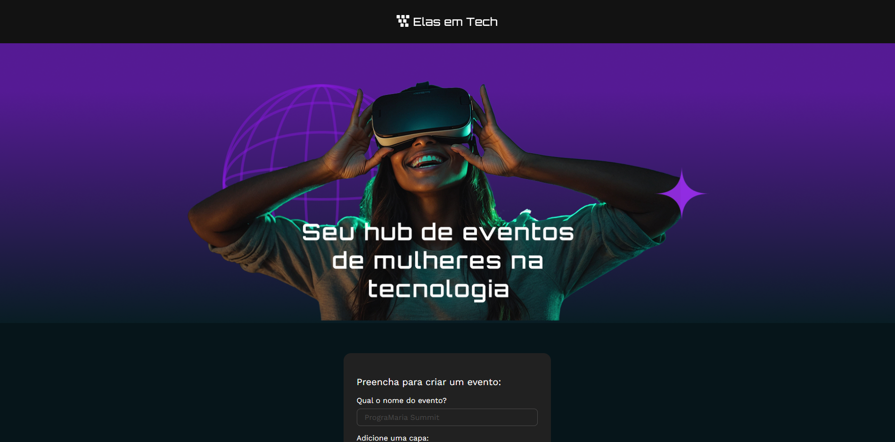

# Portfólio Front-End + UX/UI

Bem-vindo(a) ao meu portfólio! 🚀 

Aqui compartilho meus estudos e projetos em **desenvolvimento front-end** (JavaScript, React 19, Vite) e **UX/UI Design**.  

Este repositório reúne **projetos práticos**, **protótipos no Figma** e **case studies** que estou desenvolvendo ao longo da minha jornada de transição de carreira para o front-end/UX.  

---

## 🛠️ Tecnologias & Ferramentas  
- **Front-End:** HTML5, CSS3, JavaScript (ES6+), React 19, Vite  
- **UX/UI Design:** Figma, Design System, Prototipação, Pesquisa com Usuários  
- **Outros:** Git, GitHub 

---

## 🚀 Projetos em Destaque

### Elas em Tech - Cadastro de Eventos
O Elas em Tech é um formulário interativo para registrar eventos de mulheres na tecnologia.
Aplicação desenvolvida durante o curso *React 19: JSX, componentes, form action e useState*, da Alura.

Trabalhei conceitos de componentes, props, estados e estilização.  

🛠 **Tecnologias:**

 
 
 

🔗 [Repositório](https://github.com/renataarruda/portfolio-frontend-ux/tree/main/projects/react-projects/elas-em-tech) | [Demo](https://elas-em-tech.vercel.app/)

(Mais projetos em breve)

## 🎨 UX/UI Case Studies

### GoVeg App – Localizador de opções veganas
Aplicativo conceitual criado durante o curso da CalArts, focado em explorar fundamentos de UI como composição, hierarquia, convenções visuais e construção de telas.
O projeto foi desenvolvido no Miro e marcou meus primeiros passos em design de interfaces.

🔗 [GoVeg App](docs/ui-case-studies/goveg-case.md)

---
✨ Obrigada por visitar meu portfólio!  
