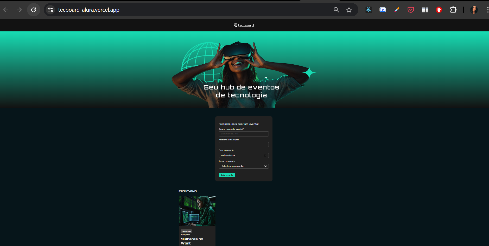

# Portfólio Front-End + UX/UI

Bem-vindo(a) ao meu portfólio! 🚀  
Aqui compartilho meus estudos e projetos em **desenvolvimento front-end** (JavaScript, React 19, Vite, Next 15) e **UX/UI Design** (Google UX Design Certificate - Coursera).  

Este repositório reúne **projetos práticos**, **protótipos no Figma** e **case studies** que desenvolvi ao longo da minha jornada de transição de carreira para tecnologia.  

---

## 🛠️ Tecnologias & Ferramentas  
- **Front-End:** HTML5, CSS3, JavaScript (ES6+), React 19, Next 15, Vite  
- **UX/UI Design:** Figma, Design System, Prototipação, Pesquisa com Usuários  
- **Outros:** Git, GitHub 

---

## 🚀 Projetos em Destaque

### Tecboard - Cadastro de Eventos
📍 **Descrição:** O Tecboard é um formulário interativo para registrar eventos de tecnologia.
Aplicação desenvolvida durante o curso *React 19: JSX, componentes, form action e useState*, da Alura.

💡 Trabalhei conceitos de componentes, props, estados e estilização.  

🛠 **Tecnologias:**

 
 
 
  

🔗 [Repositório](https://github.com/renataarruda/portfolio-frontend-ux/tree/main/projects/react-projects/tecboard-alura) | [Demo](https://tecboard-alura.vercel.app/)

## 🎨 UX Case Studies

Em andamento

---
✨ Obrigada por visitar meu portfólio!  
