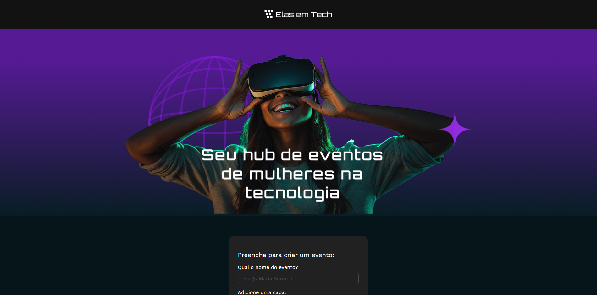

# Elas em Tech - Cadastro de Eventos de Mulheres na Tecnologia

## Sobre o projeto
O **Elas em Tech** é um formulário interativo para **cadastro de eventos de tecnologia voltados para mulheres**, desenvolvido durante meus estudos em **React 19** com **Vite** ao longo do curso *React 19: JSX, componentes, form action e useState*, da Alura.

O foco foi praticar **formulários controlados** e **gerenciamento de estado com useState**.

O projeto é uma adaptação do *Tecboard* apresentado no curso.

## Objetivo de Aprendizado
- Organizar e estruturar componentes em React.
- Trabalhar com **props** e **state** em formulários controlados.
- Configurar ambiente com **Vite** para desenvolvimento rápido.

---

## Tecnologias utilizadas

[]() 
[]() 
[]() 
[]()  

## Screenshot


---

## Como rodar o projeto
```bash
Clone este repositório:

git clone 
[https://github.com/renataarruda/portfolio-frontend-ux/tree/main/projects/react-projects/tecboard-alura]

Entre na pasta do projeto:  
cd 

Instale as dependências:  
npm install

Inicie o servidor de desenvolvimento:  
npm run dev

Abra no navegador:  
http://localhost:5173
```

## Links
[Demo Online](https://elas-em-tech.vercel.app/)

## Aprendizado
*Este projeto marcou meu primeiro contato com React 19 e Vite, me ajudando a consolidar conceitos de componentes e formulários.*

